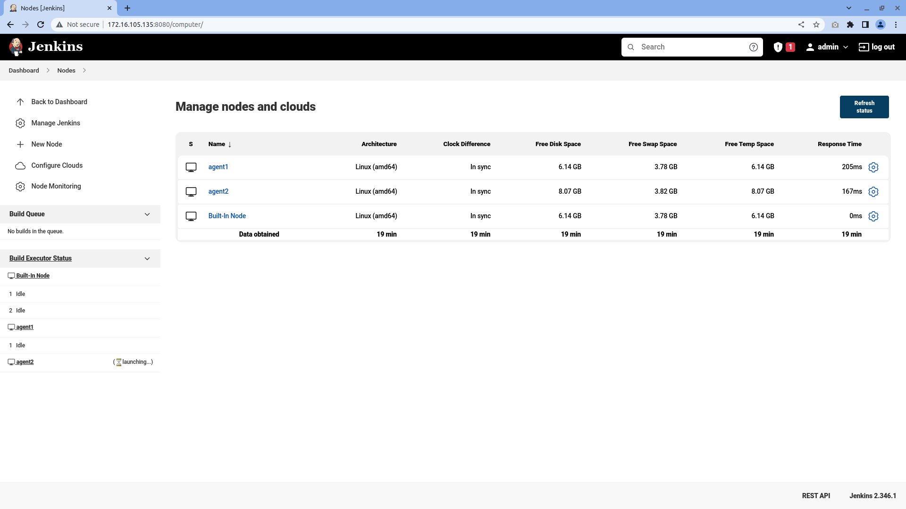
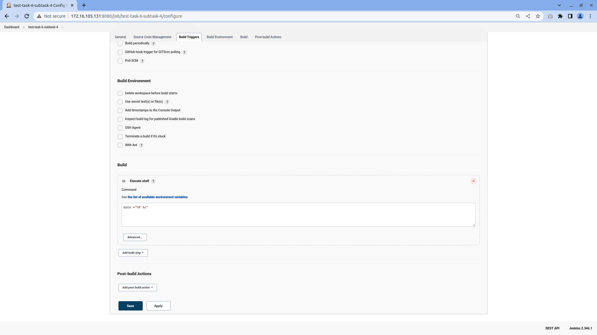
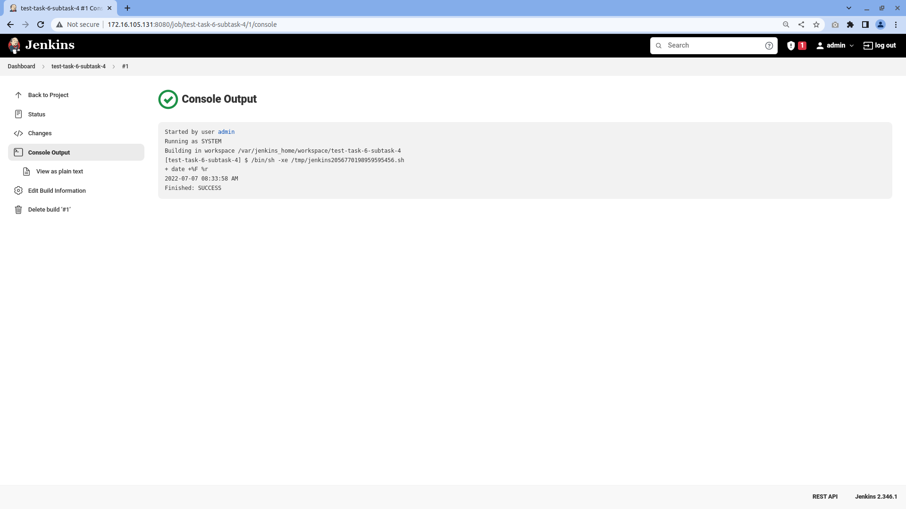
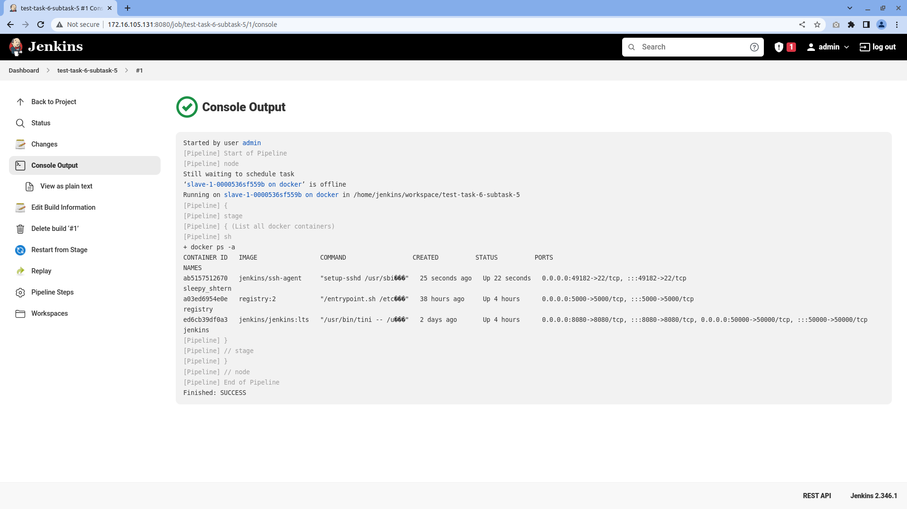

# Task 6 (Jenkins)

## Task 1 - Install Jenkins. It must be installed in a docker container.
To install and run Jenkins I used [`this`](./docker-compose.yaml) compose file:

To start this compose file run commands:
``` bash
cd Task6
docker-compose up -d
```


## Task 2 - Install necessary plugins (if you need).

I installed next Jenkins plugins:
- [Docker](https://plugins.jenkins.io/docker-plugin/)


## Task 3 - Configure several (2-3) build agents. Agents must be run in docker.

You can find compose file for [first](./Subtask3/vm1) and [second](./Subtask3/vm2) VMs

To add them to Jenkins do next things:
  - Click `Manage Jenkins` menu item
  - Click `Manage Nodes and Clouds` menu item
  - Click `New Node` menu item
  - Enter node name
  - Select type `Permanent Agent`
  - Set next values for each key:
    - Description: `Description for agent`
    - Remote root directory: `/home/jenkins`
    - Labels: Name of agent
    - Usage: `Only build jobs with label expressions matching this node`
    - Launch method: `Launch agents via SSH`
      - Host: IP of host that agent installed
      - Credentials: Private key created for this agent
      - Host Key Verification Strategy: `Non verifying Verification Strategy`

You need to wait some time
Check if firewall is allowing specified port

And now you can select agents that can be used for builds

More info can be found [here](https://www.jenkins.io/doc/book/using/using-agents/)

Result:



## Task 4 - Create a Freestyle project. Which will show the current date as a result of execution.

To complete this task you need:
- At home page click `New Item` button
- In job creation page do following:
  - Create name for job (I used `task-6-subtask-4`)
  - Select `Freestyle project`
  - Then click **OK**, you will be redirected to `Job settings` page
- In `Job settings` page:
  - Scroll bottom to `Build` block
  - Click `Add build step` button
  - From list select `Execute shell`
  - At `Execute shell` step to `Command` field enter `date +"%F %r"`
  - Click **Save** button at end of the page
- At right side of actions select `Build now` button. After 5-10 seconds you will see new item in `Build history` list in the page.
- After a few seconds click on date and time of last (on the top of list) build time
- Then click `Console output` link
- You will see the time and date when the program was launched

There's screenshots of configuration and result of job:




## Task 5 - Create Pipeline which will execute docker ps -a in docker agent, running on Jenkins master’s Host.

To complete this task you need to do following steps:
- Created private and public SSH keys
- Edit file `/lib/systemd/system/docker.service` (as sudo):
  - `ExecStart` option looks like this:

    ``` systemd
    ... 
    ExecStart=/usr/bin/dockerd -H fd:// --containerd=/run/containerd/containerd.sock
    ...
    ```
  - Add ` -H tcp://0.0.0.0:4243`(with space at start) runtime option to docker daemon in `ExecStart` option before/after another `-H` option
  - Now `ExecStart` option should look like this:

    ``` systemd
    ... 
    ExecStart=/usr/bin/dockerd -H tcp://0.0.0.0:4243 -H fd:// --containerd=/run/containerd/containerd.sock
    ...
    ```
  - Restart Docker service: `systemctl restart docker.service`

- Set-up Docker runner nodes:
  - Click `Manage Jenkins` menu item
  - Click `Manage Nodes and Clouds` menu item
  - Click `Configure Clouds` menu item
  - Click `Add new cloud` button
  - Select `Docker` from dropdown (You should install Docker plugin to make this option available)
  - Name your docker source (default is `docker`)
  - Click `Docker Cloud details` button
    - Enter value `tcp://172.16.105.131:4243/` to `Docker Host URI`
    - Click `Test Connection` button to check if Jenkins can connect to Docker service in target
        - It should display text `Version = x.x.x, API Version = x.x` before button
        - If text is not look like previous step you should test connection between servers
    - Check `Enabled` and `Expose DOCKER_HOST` checkbox after `Test Connection` button
  - Click `Docker Agent templates` button
    - Click `Add Docker Template`
    - Enter labels to make this agent selectable for jobs
    - Check `Enabled` checkbox after `Labels` field
    - Enter prefix to be used when generating node names in `Name` field
    - Enter docker image name for `Docker Image` field that will be pulled and runned when jobs started in this nodes
      - It should contain SSH server and Java JDK (version 8 or 11) to run properly
      - If you're using private repository you can select (or create) credentials to pull these images
    - Click `Container settings` button
      - Enter next text to `Mounts` field (Click down button to shrink line to make it multiline):
      ```
        type=bind,src=/var/run/docker.sock,dst=/var/run/docker.sock,ro=0
        type=bind,src=/usr/bin/docker,dst=/usr/bin/docker,ro=0
      ```
      - Enter next key/value to `Environment` field. Key is `JENKINS_SLAVE_SSH_PUBKEY`, value is public key that you've created at first step:
        ```
        JENKINS_SLAVE_SSH_PUBKEY=ssh-rsa ... ...
        ```

      - Set `Remote File System Root` field value to `/home/jenkins`

      - Set `Connect method` field value to `Connect with SSH`

      - Set `SSH key` field value to `Use configured SSH credentials`

      - You need to select or create private key for Jenkins
        - If you've private key you can use it by selecting from list
        - If you not created/added private key in Jenkins do next steps:
          - Click `Add` after `SSH Credentials` field
          - Select credentials store (by default `Jenkins`)
          - Set `Kind` field value to `SSH Username with private key`
          - Type `ID` field value (value for internal usage)
          - `Description` for user friendly display text
          - `Username` that will be name of user when logging in
          - Set `Private Key` field value to `Enter directly` radio button
          - Click `Add` button to private key for your public key that you've entered
          - (If you entered passphrase for your private key you can type it in `Passphrase` field)
          - Click `Add` button

      - Set `SSH Credentials` field value to name that you've just created before
      - Set `Host Key Verification Strategy` field value to `Non verifying Verification Strategy`

- Set-up pipeline:
  - Create new pipeline with type `Pipeline`
  - Enter next text to `Script` field:

    ``` groovy
    pipeline {
        agent { label 'slave-1' }
        stages {
            stage('List all docker containers') {
                steps {
                    sh 'docker ps -a'
                }
            }
        }
    }
    ```
  - Run just created pipeline

Results of pipeline:




## Task 6 - Create Pipeline, which will build artifact using Dockerfile directly from your github repo (use Dockerfile from previous task).


## Task 7 - Pass  variable PASSWORD=QWERTY! To the docker container. Variable must be encrypted!!!


