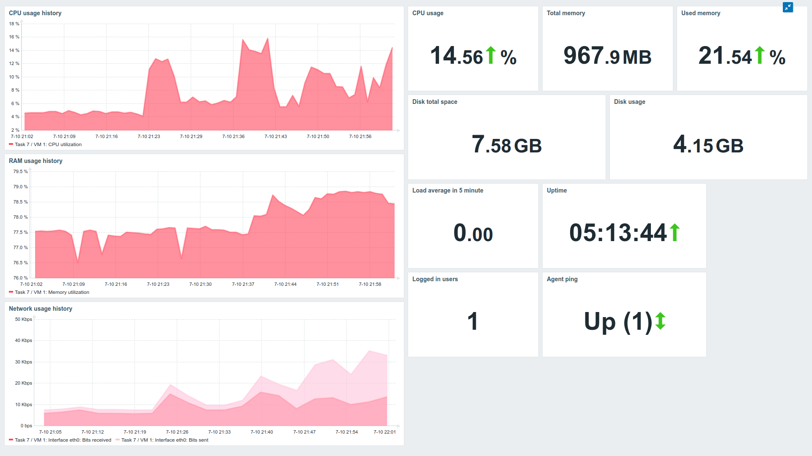
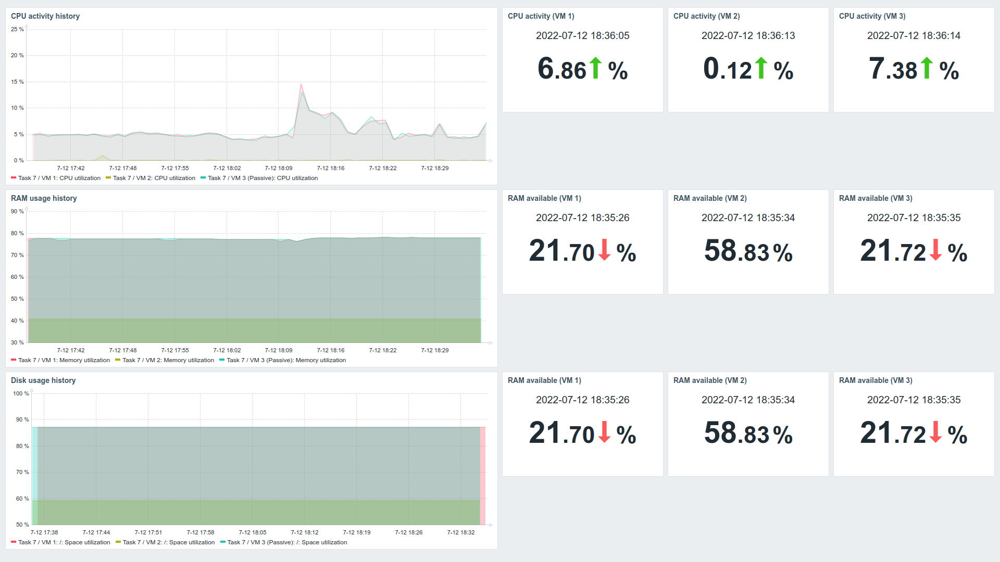
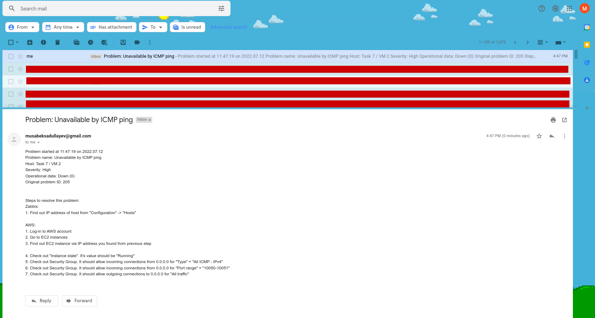
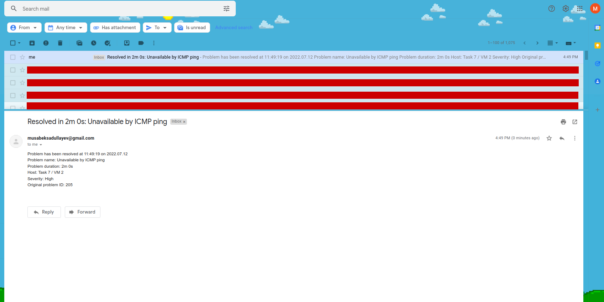
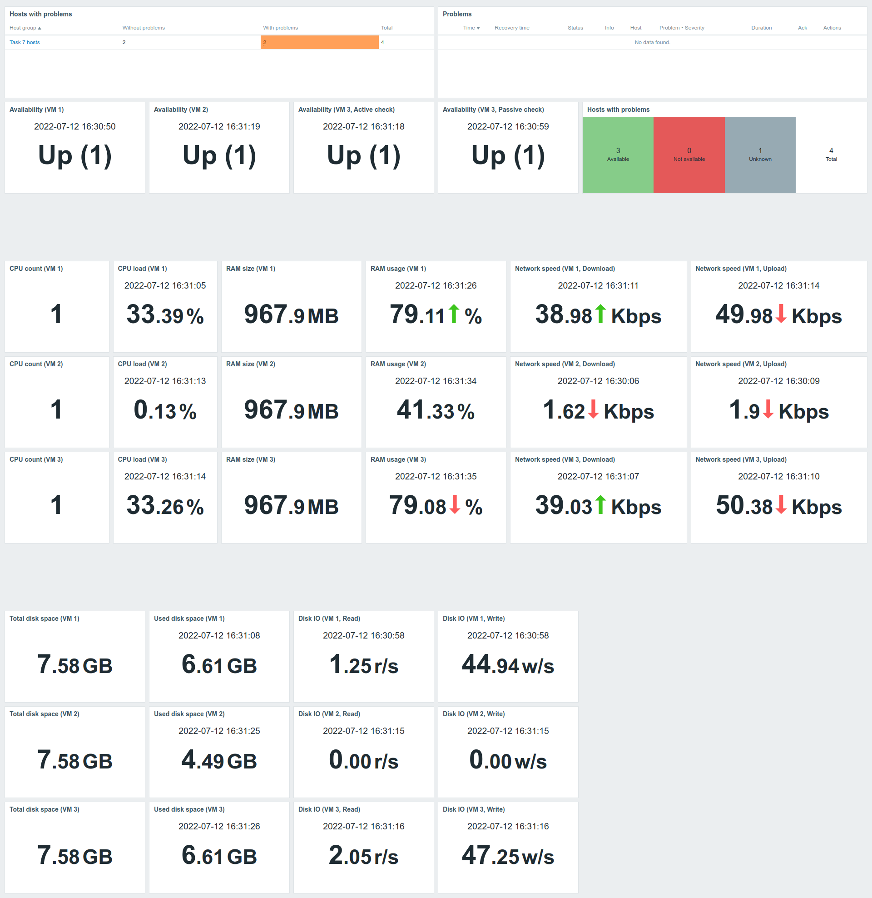

# Task 7 - Subtask 1 (Monitoring / Zabbix)

## Install on server, configure web and base

> I used official Docker images of Zabbix and MySQL to run Zabbix as a container with Docker compose \
This compose file can be found [here](https://github.com/zabbix/zabbix-docker)


## Prepare VM or instances.

> I used Terraform to create AWS EC2 instances. \
You can find terraform file [here](./terraform)


## Install Zabbix agents on previously prepared servers or VM.

> I installed Zabbix agents manually to all AWS EC2 instances.
I used next commands:
``` bash
sudo apt-get install zabbix-agent  # Install Zabbix agent package
nano /etc/zabbix/zabbix_agentd.conf  # Set 'Server' variable value to Public IP of Zabbix server (without port)
sudo systemctl restart zabbix-agent  # Restart Zabbix agent
```


## Make several of your own dashboards, where to output data from your host/vm/container (one of them)

Created two dashboards:


Only for first VM



For all three VMs


## Active check vs passive check - use both types.


- Setup **passive** zabbix agent:
  - Server (Connect to server via SSH and run next commands):
    ``` bash
    sudo apt-get install zabbix-agent
    sudo sed -ie 's/Server=127.0.0.1/Server=<PUBLIC_IP_OF_ZABBIX_SERVER>/g' /etc/zabbix/zabbix_agentd.conf
    sudo systemctl restart zabbix-agent
    ```
  - UI (Actions need to run in Zabbix):
    - Go to `Configuration` > `Hosts` > `Create host`
    - Enter next values:
        - Host name: `x.x.x.x` (Public IP of Zabbix agent)
        - Visible name: `VM-X (Passive)` (Name of the host to be displayed in Zabbix)
        - Templates:
          - "`Linux by Zabbix agent`"
        - Host groups:
          - (Host groups of your selection)
        - Interfaces:
          - Type: `Agent`
          - IP address: `x.x.x.x` (Public IP of Zabbix agent)
          - Port: `10050`
    - Then click "Add"


- Setup **active** zabbix agent:
  - Setup passive host (you can find it in previous block)
  - Server (Connect to server via SSH and run next commands):
    ``` bash
    sudo apt-get install zabbix-agent
    sudo sed -ie 's/Server=127.0.0.1/Server=<PUBLIC_IP_OF_ZABBIX_SERVER>/g' /etc/zabbix/zabbix_agentd.conf
    sudo sed -ie 's/# ServerActive=/Server=<PUBLIC_IP_OF_ZABBIX_SERVER>/g' /etc/zabbix/zabbix_agentd.conf
    sudo sed -ie 's/# Hostname=/Hostname=<HOSTNAME_OF_VM>/g' /etc/zabbix/zabbix_agentd.conf
    sudo systemctl restart zabbix-agent
    ```
  - UI (Actions need to run in Zabbix):
    - Go to `Configuration` > `Hosts` > `Create host`
    - Enter next values:
        - Host name: `VM-X` (Linux hostname of host)
        - Visible name: `VM-X (Active)` (Name of the host to be displayed in Zabbix)
        - Templates:
          - "`Linux by Zabbix agent active`"
        - Host groups:
          - (Host groups of your selection)
        - Interfaces:
          - Type: `Agent`
          - DNS name: `VM-X` (Linux hostname of host)
          - Port: 10050


## Make an agentless check of any resource (ICMP ping)

- Setup ICMP ping host check (More info can be found [here](http://woshub.com/zabbix-simple-icmp-ping-checks/)):
  - UI:
    - Go to `Configuration` > `Hosts` > `Create host`
    - Enter next values:
        - Host name: `VM-X` (Linux hostname of host)
        - Visible name: `VM-X` (Name of the host to be displayed in Zabbix)
        - Templates:
          - "`ICMP Ping`"
        - Host groups:
          - (Host groups of your selection)
        - Interfaces:
          - Type: `Agent`
          - IP address: `x.x.x.x` (Public IP of Zabbix agent)
          - Port: `10050`


## Provoke an alert - and create a Maintenance instruction

> I disabled allowing to accept incoming ICMP connections to trigger real life like incident \
Zabbix sent alerts to my inbox (I do setup my GMail account to send incident messages to my inbox)


<p align="center">
    Incident email screenshot
</p>



<p align="center">
    Resolved email screenshot
</p>


## Set up a dashboard with infrastructure nodes and monitoring of hosts and software installed on them


<p align="center">
    Dashboard with hosts/nodes status
</p>
