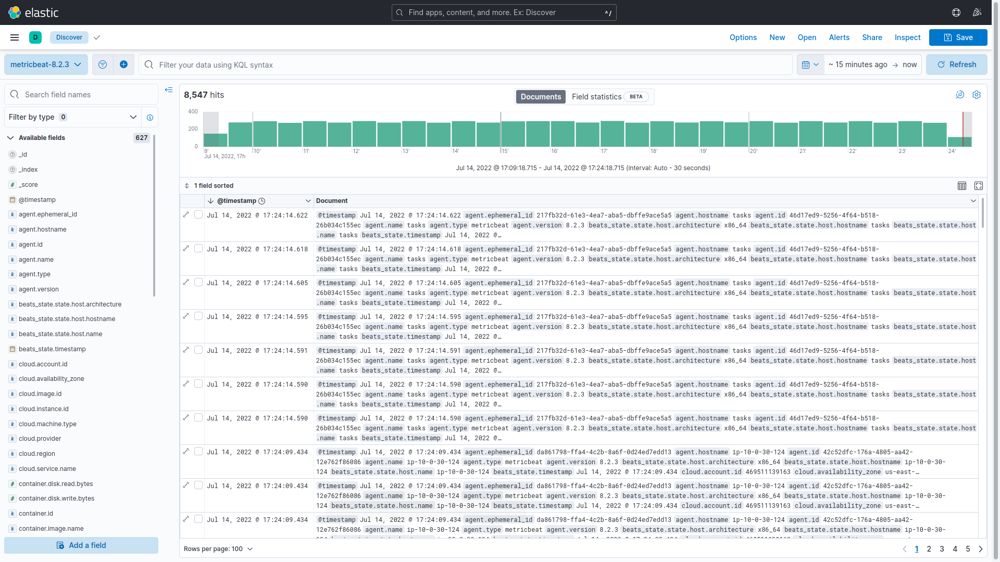
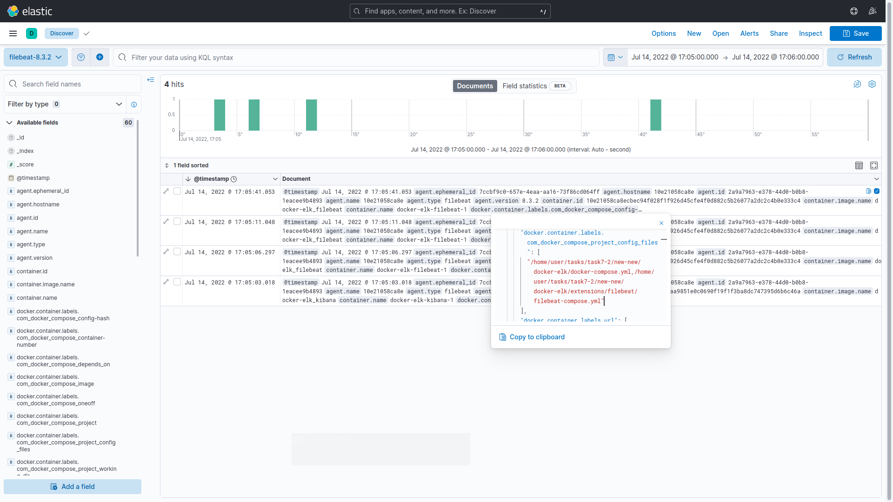
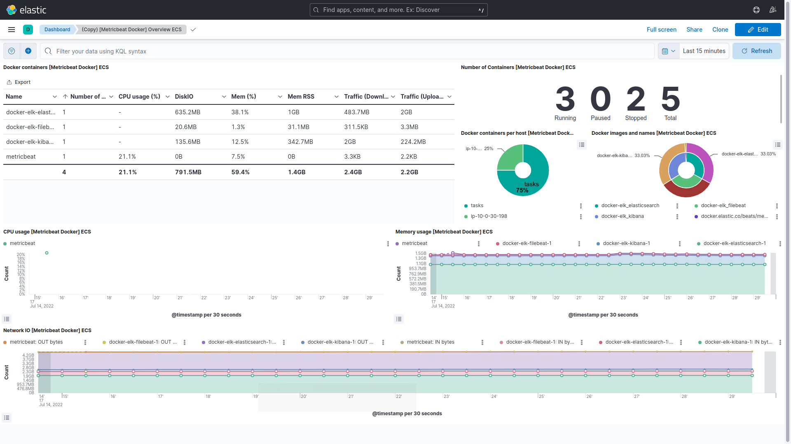

# Task 7 - Subtask 1 (Monitoring / ELK)

## 1. Install and configure ELK

> Used Docker image from [this](https://github.com/deviantony/docker-elk) repo
  ``` bash
  git clone https://github.com/deviantony/docker-elk
  cd docker-elk
  docker-compose up -d

  cd extensions/filebeat/
  docker-compose -f ./filebeat-compose.yml up -d
  ```

  Then open:
  - http://localhost:5601 - for Elastic UI
  - http://localhost:9200 - for ElasticSearch


## 2. Organize collection of logs from Docker to ELK and receive data from running containers

> 

- UI:
  - In home page of Elastic UI click `Add integrations` button
  - Type `Docker` to `Search for integrations` field
  - As you type `Docker Metrics` will appear in list of integrations
  - Click on it
  - Run steps to install Metricbeat
  - Click check data
    - If you see `Data successfully received from this module` text that means agent is working normal
    - If you see text other than previous step you should troubleshoot agent connection
  - Then click `Docker metrics dashboard` button on bottom of the page
  - You can see initial dashboard with information about Docker containers

- Server:
  - Connect to target server(s) via SSH
  - Run command to start sending metrics to Elasticsearch:
    ``` bash
    docker run \
      -d \
      --name=metricbeat \
      --user=root \
      --volume="/var/run/docker.sock:/var/run/docker.sock:ro" \
      docker.elastic.co/beats/metricbeat:8.3.2 metricbeat \
      -e -E output.elasticsearch.hosts=["<ELASTICSEARCH_HOST_OR_IP>:9200"]
    ```
  - Run commands:
    ``` bash
    wget https://artifacts.elastic.co/downloads/beats/metricbeat/metricbeat-8.2.3-amd64.deb
    sudo dpkg -i metricbeat-8.2.3-amd64.deb`
    nano /etc/metricbeat/metricbeat.yml`
    ```
    In the last command content of file should look like this:
    ``` yaml
      output.elasticsearch:
        hosts: ["<ELASTICSEARCH_HOST_OR_IP>:9200"]
        username: "<USERNAME_OF_ELASTICSEARCH_USER>"
        password: "<PASSWORD_OF_ELASTICSEARCH_USER>"
      setup.kibana:
        host: "<KIBANA_HOST_OR_IP>:5601"
    ```


Result:


<p align="center">Logs from hosts</p>



<p align="center">Filebeat installation</p>

## 3. Customize your dashboards in ELK

> One of customized dashboards



<p align="center">Added network traffic (Upload/Download) and total container count</p>


## 4. Configure monitoring in ELK, get metrics from your running containers

This task is completed in Task #2

## 5. Study features and settings

> 
