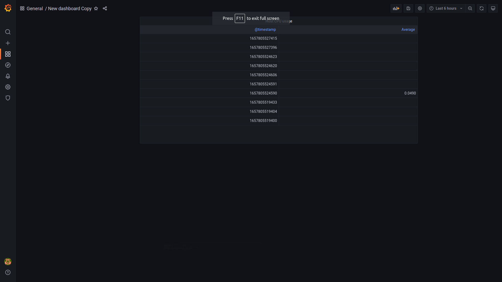

# Task 7 - Subtask 1 (Monitoring / Grafana)

## 1. Install and configure ELK

1. Run next command to pull and start Grafana:
``` bash
cd Task7/Subtask3/
docker-compose up -d
```

2. Then open http://localhost:3000
3. At login page type admin/admin as credentials
4. Update password if needed

## 2. Integrate with installed ELK:
1. Go to `Configuration` > `Data sources`
2. Click `Add data source`
3. Find out `Elasticsearch` and click on it
4. Fill all required field then click `Save and test`
5. If all data is written valid your data source will be added


## 3. Set-up dashboards:


<p align="center">Grafana dashboard</p>
